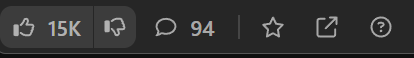
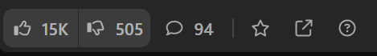

# 
LeetCode Dislikes

  

Bring back dislike count of problems on [Leetcode.com](https://leetcode.com/) with this handy Chrome extension.

## Features

**Quality Problem Solving**: Say goodbye to solving useless questions that make no sense. This tool allows you to see the dislike count of each problem on Leetcode, so you can avoid the bad ones.

#### Before :

#### After :

## Getting Started

1. Clone or download this repository.

3. Open your Google Chrome browser.

4. Navigate to `chrome://extensions/`.

5. Enable the "Developer mode" option in the top right corner.

6. Click on "Load unpacked" and select the folder where you cloned/downloaded the repository.

7. The extension should now be installed and ready to use.

8. Visit [Leetcode.com](https://leetcode.com/) and log in.

9. You should be able to see the dislikes.

10. If you are already on Leetcode, refresh the page.

## Support and Contribution

If you encounter any issues or have suggestions for improvements, please open an issue on the [GitHub repository](https://github.com/Ash-codes18/LeetCode-Dislikes/issues).

Feel free to contribute to this project by submitting pull requests or by addressing any open issues.

## License

This project is licensed under the MIT License - see the [LICENSE](https://github.com/Ash-codes18/LeetCode-Dislikes/blob/main/LICENSE) file for details.
